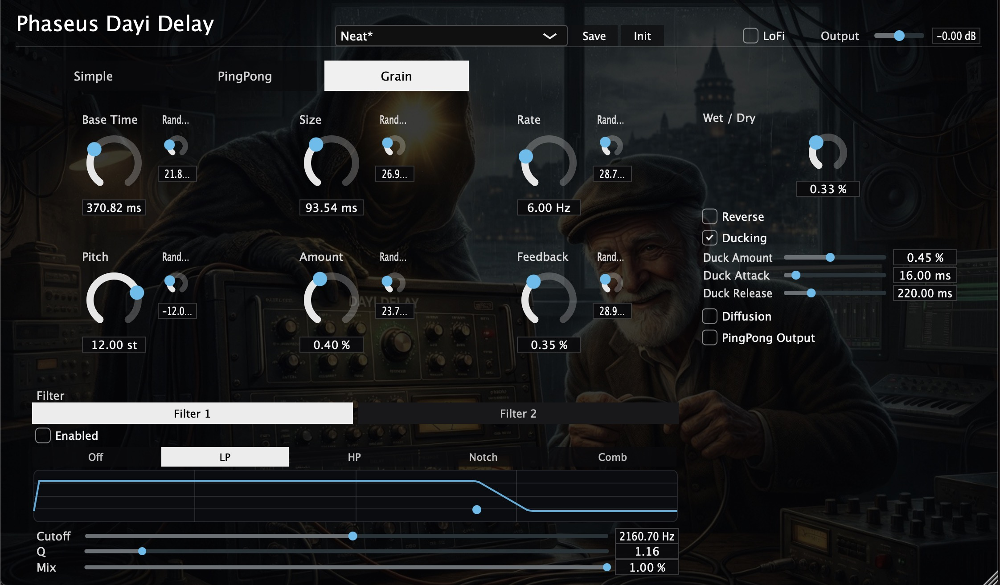

# PHASEUS Dayi Delay Manual

Official repository: [executionreverted/phaseus-audio-plugins](https://github.com/executionreverted/phaseus-audio-plugins)

## Overview

**PHASEUS Dayi Delay** is a multi-mode stereo delay plugin with:

- 3 delay engines: `Simple`, `PingPong`, `Grain`
- Tempo sync support
- Random modulation controls
- Reverse, Ducking, LoFi, Diffusion
- Dual filter workflow (`Filter 1`, `Filter 2`)
- Preset system

## Interface

Header:

- Left: plugin title
- Center: preset bar (`Init`, preset list, `Save`, `Init`)
- Right: `Output Gain` and `LoFi` toggle

Main area:

- Top tabs: `Simple`, `PingPong`, `Grain`
- Left side: mode controls + fixed filter section
- Right side: global controls (`Wet/Dry`, reverse, ducking, diffusion, etc.)

## Signal Flow (High Level)

1. Input enters selected delay mode.
2. Delay wet signal can be processed by optional stages:
   - Reverse
   - Diffusion
   - Ducking
   - LoFi
   - Filter section
3. Wet signal is mixed with dry signal using `Wet/Dry`.
4. Final level is set by `Output Gain`.

## Delay Modes

## 1) Simple

- `Time`
- `Feedback`
- Random controls (right-side mini knobs)
- Tempo Sync + musical division

## 2) PingPong

- `Time Left`, `Time Right`
- `Feedback Left`, `Feedback Right`
- Link switches for L/R time and feedback
- Random controls for time/feedback pairs
- Tempo Sync support

Chain icon is shown only when related link is active.

## 3) Grain

- `Base Time`
- `Size`
- `Rate`
- `Pitch`
- `Amount`
- `Feedback`
- `PingPong Output` + pan
- Random controls for grain parameters

## Global Controls

- `Wet/Dry`
- `Output Gain` (dB)
- `LoFi` + `LoFi Amount`
- `Reverse` + `Reverse Mix` + `Start Offset` + `End Offset`
- `Ducking` + amount/attack/release
- `Diffusion` + amount/size

## Filter Section (Filter 1 / Filter 2)

Both filter slots share one edit panel (switch with tabs).

Per slot:

- `Enabled`
- Type: `Off / LP / HP / Notch / Comb`
- `Cutoff`, `Q`, `Mix`
- Comb controls when Comb is selected

Current routing behavior:

- `Filter 1` input is always **wet delay signal**
- If `Filter 2` is enabled: `Filter 1 -> Filter 2 -> Out`
- If `Filter 2` is disabled: `Filter 1 -> Out`

## Presets

- Save from header `Save` button.
- Presets are loaded from the preset list.
- `Init` resets plugin parameters to defaults.
- If an old preset does not contain newly added parameters, missing parameters stay at default values.

## Usage Tips

- Start with `Wet/Dry` around 25-40%.
- For clean space: use `Filter 1` as high-cut on wet signal.
- For character: enable `Diffusion` at low amount.
- For rhythmic width: use `PingPong` with sync and linked feedback.
- For experimental textures: use `Grain` + subtle random values.

## Installation Notes (macOS)

VST3 build output/install path:

- `~/Library/Audio/Plug-Ins/VST3/PHASEUS_Delay.vst3`

